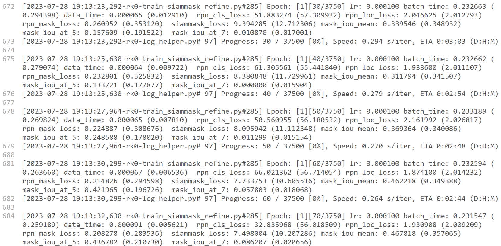
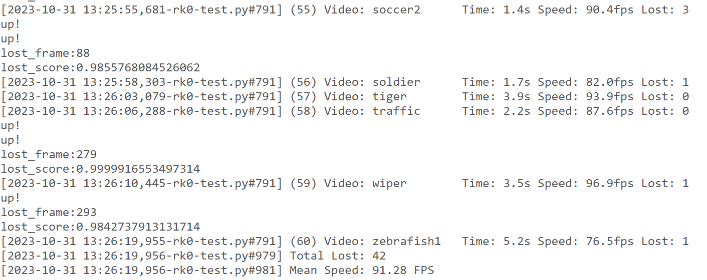

# QuuTrack
QuuTrack is a single object tracking (SOT) algorithm that is written in Python and powered by the PyTorch deep learning framework, and the project also includes a Python toolkit for evaluating trackers.
Only the improved siammask project is currently supported.

<div style="display: flex; justify-content: center;">
  
</div>


# Environment Configuration
Our experiments are based on Ubuntu18.04, NVIDIA GTX 3070 (8GB), cuda11.3, cudnn8.3.2, python3.8 and pytorch1.12.1. The environment is not strictly required, you can choose according to your actual situation.

Other dependencies can be installed using the following command:

```
pip install -r requirements.txt
```

More detailed installation guide can refer to [SiamMask](https://github.com/foolwood/SiamMask).

# Training
## Prepare the training data set
Four datasets were used for training: youtub-VOS (13GB), ILSVRC2015-VID (65GB), ILSVRC2015_DET (about 50GB) and COCO (51GB). 
Ensure that the device has sufficient memory in advance. Please refer to the readme file under each data set file for download methods and data processing.

## Prepare the pre-training model
Our experimental optimal weight file:
link：https://pan.baidu.com/s/18cghwTinKE7lKLITFWQY2w 
code：sqst 
You can also refer to the SiamMask original author's weight file：
link：https://pan.baidu.com/s/19YWqnaoa35ARa2rHjHkZPg 
code：0qqt 

## The first stage of training:

```
cd $SiamMask/experiments/siammask_base/
bash run.sh
```

## Find the optimal weight file from the results of the first stage and conduct the second stage training:

```
cd $SiamMask/experiments/siammask_sharp
bash run.sh <best_base_model>
bash run.sh checkpoint_e12.pth
```

You will see:

# Testing
## Test data set preparation
This experimental code test.py is only tested on VOT2016, VOT2018 and VOT2019 datasets. If you want to test more datasets, please refer to pysot-tookit and download more test datasets according to the guidance (OTB100(OTB2015), UAV123, NFS, etc.). LaSOT, LaSOText, TrackingNet (Evaluation on Server), GOT-10k (Evaluation on Server)) and modify the corresponding code.

## testing
For example, specifying the VOT2018 dataset for testing (test_all includes both testing and evaluation procedures)
Go to the experiment directory such as：

```
cd $SiamMask/experiments/siammask_sharp
bash test_all.sh -s 1 -e 20 -d VOT2018 -g 1
```

You will see:



# Reference 

[Fast Online Object Tracking and Segmentation: A Unifying Approach](https://arxiv.org/pdf/2207.02088.pdf).


# acknowledgement

Our code is based on Dr. Wang Qiang's project siammask, and we would like to express our sincere thanks.

@inproceedings{wang2019fast,
    title={Fast online object tracking and segmentation: A unifying approach},
    author={Wang, Qiang and Zhang, Li and Bertinetto, Luca and Hu, Weiming and Torr, Philip HS},
    booktitle={Proceedings of the IEEE conference on computer vision and pattern recognition},
    year={2019}
}
